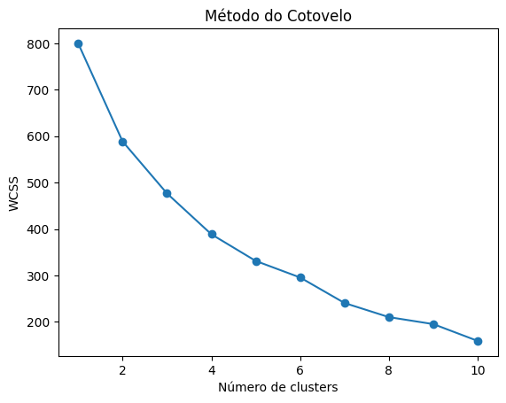
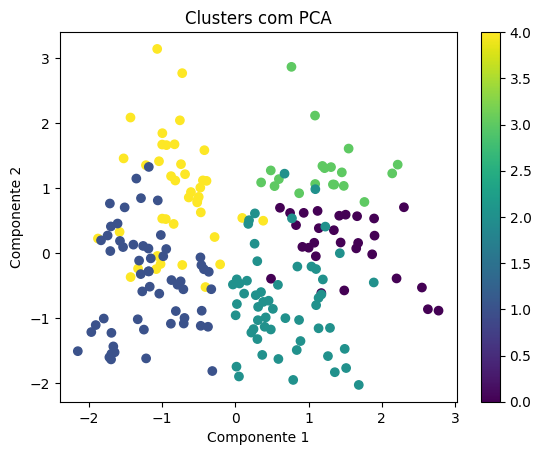
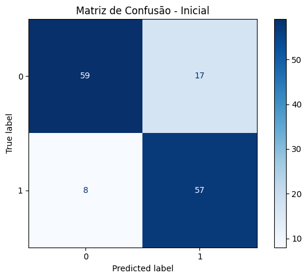
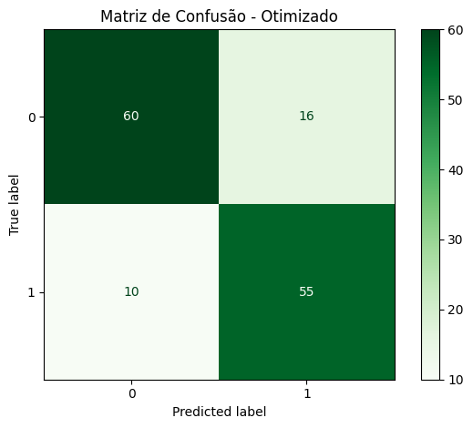
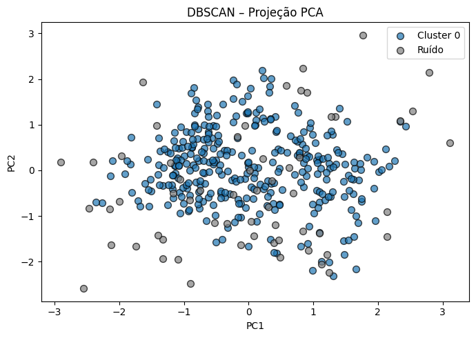

# Ficha de Avaliação – UFCD 10810

**Fundamentos do Desenvolvimento de Modelos Analíticos em Python**

**Objetivo**:  Avaliar  a  aplicação  de  conhecimentos  em  modelos  analíticos  supervisionados  e  não  supervisionados, com base em datasets reais e públicos.


Os Exercícios 1 e 2 são totalmente orientados, pelo que bastará reproduzir o código. Se quiseres podes acrescentar melhorias.

No final são apresentados dois exercícios que deverás resolver autonomamente.

**Por fim, anexa todos os ficheiros ou ficheiro obtidos na resolução desta Ficha à secção correspondente no moodle.**

---

# Exercício 1 – Clustering com K-Means (Modelo Não Supervisionado)
(5 valores)

Faz o download do dataset  em https://www.kaggle.com/datasets/abdallahwagih/mall-customers-segmentation 

**Contexto**:
Pretende-se segmentar clientes de um centro comercial com base nas suas características de consumo, para apoiar ações de marketing direcionado. 

**Passos obrigatórios**:
1. Carregar e explorar os dados (verificar colunas e tipos). 
2. Aplicar pré-processamento: 
    a. Tratar valores ausentes, se existirem. 
    b. Normalizar as colunas numéricas. 
    c. Codificar variáveis categóricas com OneHotEncoder, se necessário. 
3. Determinar o número ideal de clusters usando o **Modelo do Cotovelo**. 
4. Aplicar **K-Means** com o número ótimo de clusters. 
5. Avaliar o clustering com o **Coeficiente de Silhueta**. 
6. Visualizar os clusters em 2D com **PCA**.
7. Interpretar os grupos formados (ex: características dos clientes por grupo)


```python
# exercicio1_kmeans_mall.py

import pandas as pd
from sklearn.preprocessing import StandardScaler, OneHotEncoder 
from sklearn.cluster import KMeans 
from sklearn.metrics import silhouette_score 
from sklearn.decomposition import PCA 
import matplotlib.pyplot as plt
```


```python
# 1. Carregar dados 
df = pd.read_csv("data/Mall_Customers.csv")
print(df.info())
print(df.head())

```

    <class 'pandas.core.frame.DataFrame'>
    RangeIndex: 200 entries, 0 to 199
    Data columns (total 5 columns):
     #   Column                  Non-Null Count  Dtype 
    ---  ------                  --------------  ----- 
     0   CustomerID              200 non-null    int64 
     1   Genre                   200 non-null    object
     2   Age                     200 non-null    int64 
     3   Annual Income (k$)      200 non-null    int64 
     4   Spending Score (1-100)  200 non-null    int64 
    dtypes: int64(4), object(1)
    memory usage: 7.9+ KB
    None
       CustomerID   Genre  Age  Annual Income (k$)  Spending Score (1-100)
    0           1    Male   19                  15                      39
    1           2    Male   21                  15                      81
    2           3  Female   20                  16                       6
    3           4  Female   23                  16                      77
    4           5  Female   31                  17                      40
    


```python
# 2. Pré-processamento 
# Verificar e remover colunas não numéricas ou pouco informativas 
df = df.drop("CustomerID", axis=1) 
```


```python
# One-hot encoding da coluna 'Genre' 
df = pd.get_dummies(df, columns=["Genre"], drop_first=True)
```


```python
# Normalização
scaler = StandardScaler()
scaled_data = scaler.fit_transform(df)
```


```python
# 3. Modelo do Cotovelo 
wcss = [] 
for i in range(1, 11):
    kmeans = KMeans(n_clusters=i, random_state=0)
    kmeans.fit(scaled_data)
    wcss.append(kmeans.inertia_)

plt.plot(range(1, 11), wcss, marker='o') 
plt.title("Método do Cotovelo") 
plt.xlabel("Número de clusters") 
plt.ylabel("WCSS") 
plt.show()
```


    

    


```python
# 4. Aplicar KMeans com k=5 (por exemplo)
k = 5 
kmeans = KMeans(n_clusters=k, random_state=0) 
clusters = kmeans.fit_predict(scaled_data)
```


```python
# 5. Avaliar com coeficiente de silhueta
score = silhouette_score(scaled_data, clusters)
print(f"Coeficiente de Silhueta: {score:.2f}") 
```

    Coeficiente de Silhueta: 0.32
    


```python
# 6. Visualizar com PCA
pca = PCA(n_components=2) 
pca_data = pca.fit_transform(scaled_data)  

plt.scatter(pca_data[:, 0], pca_data[:, 1], c=clusters, cmap='viridis') 
plt.title("Clusters com PCA") 
plt.xlabel("Componente 1") 
plt.ylabel("Componente 2") 
plt.colorbar() 
plt.show()
```


    

    


---

# Exercício 2 – Modelo Supervisionado (Classificação com Random Forest) 
(5 valores)

Dataset: https://www.kaggle.com/datasets/cherngs/heart-disease-cleveland-uci

**Contexto**: 
Pretende-se prever a presença de doença cardíaca a partir de dados clínicos.

**Passos obrigatórios**:
 1. Carregar e explorar os dados. 
 2. Aplicar pré-processamento: 
    a. Normalizar variáveis numéricas. 
    b. Codificar variáveis categóricas com OneHotEncoder. 
    c. Verificar e remover outliers (usar **IQR** e/ou **Z-score**). 
3. Separar dados em treino/teste com **stratificação**. 
4. Aplicar o modelo **Random Forest** com validação cruzada. 
5. Otimizar hiperparâmetros com **GridSearchCV**. 
6. Avaliar o modelo com: 
    a. **Matriz de confusão** 
    b. **Acurácia, Precisão, Revocação, F1-score** 
7. Comparar desempenho antes e depois da otimização 
8. Prever o risco de doença para um novo paciente (valores fictícios).


```python
# exercicio2_randomforest_heart.py (sem scipy) 
import pandas as pd 
from sklearn.preprocessing import StandardScaler, OneHotEncoder 
from sklearn.model_selection import train_test_split, GridSearchCV, cross_val_score 
from sklearn.ensemble import RandomForestClassifier 
from sklearn.metrics import classification_report, confusion_matrix 
from sklearn.compose import ColumnTransformer 
from sklearn.pipeline import Pipeline
```


```python
# 1. Carregar dados 
df = pd.read_csv("data/heart_cleveland_upload.csv") 
print("Colunas disponíveis:", df.columns.tolist()) 
print(df.head())
```

    Colunas disponíveis: ['age', 'sex', 'cp', 'trestbps', 'chol', 'fbs', 'restecg', 'thalach', 'exang', 'oldpeak', 'slope', 'ca', 'thal', 'condition']
       age  sex  cp  trestbps  chol  fbs  restecg  thalach  exang  oldpeak  slope  \
    0   69    1   0       160   234    1        2      131      0      0.1      1   
    1   69    0   0       140   239    0        0      151      0      1.8      0   
    2   66    0   0       150   226    0        0      114      0      2.6      2   
    3   65    1   0       138   282    1        2      174      0      1.4      1   
    4   64    1   0       110   211    0        2      144      1      1.8      1   
    
       ca  thal  condition  
    0   1     0          0  
    1   2     0          0  
    2   0     0          0  
    3   1     0          1  
    4   0     0          0  
    


```python
# 2. Definir variáveis categóricas e numéricas com base na descrição 
categorical_cols = ['sex', 'cp', 'fbs', 'restecg', 'exang', 'slope', 'thal'] 
numerical_cols = ['age', 'trestbps', 'chol', 'thalach', 'oldpeak', 'ca']
```


```python
# 3. Remover outliers com base no IQR 
for col in numerical_cols:
    Q1 = df[col].quantile(0.25)
    Q3 = df[col].quantile(0.75)
    IQR = Q3 - Q1
    filtro = (df[col] >= Q1 - 1.5 * IQR) & (df[col] <= Q3 + 1.5 * IQR)
    df = df[filtro] 
```


```python
# 4. Separar X e y 
X = df[categorical_cols + numerical_cols] 
y = df["condition"]
```


```python
# 5. Dividir treino/teste com estratificação 
X_train, X_test, y_train, y_test = train_test_split(
    X, y, test_size=0.2, stratify=y, random_state=0
) 
```


```python
# 6. Pipeline com pré-processamento e modelo

preprocessor = ColumnTransformer(
    transformers=[
        ("num", StandardScaler(), numerical_cols),
        ("cat", OneHotEncoder(handle_unknown="ignore"), categorical_cols)
    ]
)

pipeline = Pipeline([
    ("pre", preprocessor),
    ("clf", RandomForestClassifier(random_state=0))
])

```


```python
# 7. Validação cruzada 
cv_scores = cross_val_score(pipeline, X_train, y_train, cv=5)
print(f"Acurácia média (antes da otimização): {cv_scores.mean():.2f}") 
```

    Acurácia média (antes da otimização): 0.81
    


```python
# 8. Otimização com GridSearchCV 
param_grid = {
    "clf__n_estimators": [50, 100],
    "clf__max_depth": [None, 10, 20]
}

grid = GridSearchCV(pipeline, param_grid, cv=5)
grid.fit(X_train, y_train)
```


<style>#sk-container-id-2 {
  /* Definition of color scheme common for light and dark mode */
  --sklearn-color-text: #000;
  --sklearn-color-text-muted: #666;
  --sklearn-color-line: gray;
  /* Definition of color scheme for unfitted estimators */
  --sklearn-color-unfitted-level-0: #fff5e6;
  --sklearn-color-unfitted-level-1: #f6e4d2;
  --sklearn-color-unfitted-level-2: #ffe0b3;
  --sklearn-color-unfitted-level-3: chocolate;
  /* Definition of color scheme for fitted estimators */
  --sklearn-color-fitted-level-0: #f0f8ff;
  --sklearn-color-fitted-level-1: #d4ebff;
  --sklearn-color-fitted-level-2: #b3dbfd;
  --sklearn-color-fitted-level-3: cornflowerblue;

  /* Specific color for light theme */
  --sklearn-color-text-on-default-background: var(--sg-text-color, var(--theme-code-foreground, var(--jp-content-font-color1, black)));
  --sklearn-color-background: var(--sg-background-color, var(--theme-background, var(--jp-layout-color0, white)));
  --sklearn-color-border-box: var(--sg-text-color, var(--theme-code-foreground, var(--jp-content-font-color1, black)));
  --sklearn-color-icon: #696969;

  @media (prefers-color-scheme: dark) {
    /* Redefinition of color scheme for dark theme */
    --sklearn-color-text-on-default-background: var(--sg-text-color, var(--theme-code-foreground, var(--jp-content-font-color1, white)));
    --sklearn-color-background: var(--sg-background-color, var(--theme-background, var(--jp-layout-color0, #111)));
    --sklearn-color-border-box: var(--sg-text-color, var(--theme-code-foreground, var(--jp-content-font-color1, white)));
    --sklearn-color-icon: #878787;
  }
}

#sk-container-id-2 {
  color: var(--sklearn-color-text);
}

#sk-container-id-2 pre {
  padding: 0;
}

#sk-container-id-2 input.sk-hidden--visually {
  border: 0;
  clip: rect(1px 1px 1px 1px);
  clip: rect(1px, 1px, 1px, 1px);
  height: 1px;
  margin: -1px;
  overflow: hidden;
  padding: 0;
  position: absolute;
  width: 1px;
}

#sk-container-id-2 div.sk-dashed-wrapped {
  border: 1px dashed var(--sklearn-color-line);
  margin: 0 0.4em 0.5em 0.4em;
  box-sizing: border-box;
  padding-bottom: 0.4em;
  background-color: var(--sklearn-color-background);
}

#sk-container-id-2 div.sk-container {
  /* jupyter's `normalize.less` sets `[hidden] { display: none; }`
     but bootstrap.min.css set `[hidden] { display: none !important; }`
     so we also need the `!important` here to be able to override the
     default hidden behavior on the sphinx rendered scikit-learn.org.
     See: https://github.com/scikit-learn/scikit-learn/issues/21755 */
  display: inline-block !important;
  position: relative;
}

#sk-container-id-2 div.sk-text-repr-fallback {
  display: none;
}

div.sk-parallel-item,
div.sk-serial,
div.sk-item {
  /* draw centered vertical line to link estimators */
  background-image: linear-gradient(var(--sklearn-color-text-on-default-background), var(--sklearn-color-text-on-default-background));
  background-size: 2px 100%;
  background-repeat: no-repeat;
  background-position: center center;
}

/* Parallel-specific style estimator block */

#sk-container-id-2 div.sk-parallel-item::after {
  content: "";
  width: 100%;
  border-bottom: 2px solid var(--sklearn-color-text-on-default-background);
  flex-grow: 1;
}

#sk-container-id-2 div.sk-parallel {
  display: flex;
  align-items: stretch;
  justify-content: center;
  background-color: var(--sklearn-color-background);
  position: relative;
}

#sk-container-id-2 div.sk-parallel-item {
  display: flex;
  flex-direction: column;
}

#sk-container-id-2 div.sk-parallel-item:first-child::after {
  align-self: flex-end;
  width: 50%;
}

#sk-container-id-2 div.sk-parallel-item:last-child::after {
  align-self: flex-start;
  width: 50%;
}

#sk-container-id-2 div.sk-parallel-item:only-child::after {
  width: 0;
}

/* Serial-specific style estimator block */

#sk-container-id-2 div.sk-serial {
  display: flex;
  flex-direction: column;
  align-items: center;
  background-color: var(--sklearn-color-background);
  padding-right: 1em;
  padding-left: 1em;
}


/* Toggleable style: style used for estimator/Pipeline/ColumnTransformer box that is
clickable and can be expanded/collapsed.
- Pipeline and ColumnTransformer use this feature and define the default style
- Estimators will overwrite some part of the style using the `sk-estimator` class
*/

/* Pipeline and ColumnTransformer style (default) */

#sk-container-id-2 div.sk-toggleable {
  /* Default theme specific background. It is overwritten whether we have a
  specific estimator or a Pipeline/ColumnTransformer */
  background-color: var(--sklearn-color-background);
}

/* Toggleable label */
#sk-container-id-2 label.sk-toggleable__label {
  cursor: pointer;
  display: flex;
  width: 100%;
  margin-bottom: 0;
  padding: 0.5em;
  box-sizing: border-box;
  text-align: center;
  align-items: start;
  justify-content: space-between;
  gap: 0.5em;
}

#sk-container-id-2 label.sk-toggleable__label .caption {
  font-size: 0.6rem;
  font-weight: lighter;
  color: var(--sklearn-color-text-muted);
}

#sk-container-id-2 label.sk-toggleable__label-arrow:before {
  /* Arrow on the left of the label */
  content: "▸";
  float: left;
  margin-right: 0.25em;
  color: var(--sklearn-color-icon);
}

#sk-container-id-2 label.sk-toggleable__label-arrow:hover:before {
  color: var(--sklearn-color-text);
}

/* Toggleable content - dropdown */

#sk-container-id-2 div.sk-toggleable__content {
  display: none;
  text-align: left;
  /* unfitted */
  background-color: var(--sklearn-color-unfitted-level-0);
}

#sk-container-id-2 div.sk-toggleable__content.fitted {
  /* fitted */
  background-color: var(--sklearn-color-fitted-level-0);
}

#sk-container-id-2 div.sk-toggleable__content pre {
  margin: 0.2em;
  border-radius: 0.25em;
  color: var(--sklearn-color-text);
  /* unfitted */
  background-color: var(--sklearn-color-unfitted-level-0);
}

#sk-container-id-2 div.sk-toggleable__content.fitted pre {
  /* unfitted */
  background-color: var(--sklearn-color-fitted-level-0);
}

#sk-container-id-2 input.sk-toggleable__control:checked~div.sk-toggleable__content {
  /* Expand drop-down */
  display: block;
  width: 100%;
  overflow: visible;
}

#sk-container-id-2 input.sk-toggleable__control:checked~label.sk-toggleable__label-arrow:before {
  content: "▾";
}

/* Pipeline/ColumnTransformer-specific style */

#sk-container-id-2 div.sk-label input.sk-toggleable__control:checked~label.sk-toggleable__label {
  color: var(--sklearn-color-text);
  background-color: var(--sklearn-color-unfitted-level-2);
}

#sk-container-id-2 div.sk-label.fitted input.sk-toggleable__control:checked~label.sk-toggleable__label {
  background-color: var(--sklearn-color-fitted-level-2);
}

/* Estimator-specific style */

/* Colorize estimator box */
#sk-container-id-2 div.sk-estimator input.sk-toggleable__control:checked~label.sk-toggleable__label {
  /* unfitted */
  background-color: var(--sklearn-color-unfitted-level-2);
}

#sk-container-id-2 div.sk-estimator.fitted input.sk-toggleable__control:checked~label.sk-toggleable__label {
  /* fitted */
  background-color: var(--sklearn-color-fitted-level-2);
}

#sk-container-id-2 div.sk-label label.sk-toggleable__label,
#sk-container-id-2 div.sk-label label {
  /* The background is the default theme color */
  color: var(--sklearn-color-text-on-default-background);
}

/* On hover, darken the color of the background */
#sk-container-id-2 div.sk-label:hover label.sk-toggleable__label {
  color: var(--sklearn-color-text);
  background-color: var(--sklearn-color-unfitted-level-2);
}

/* Label box, darken color on hover, fitted */
#sk-container-id-2 div.sk-label.fitted:hover label.sk-toggleable__label.fitted {
  color: var(--sklearn-color-text);
  background-color: var(--sklearn-color-fitted-level-2);
}

/* Estimator label */

#sk-container-id-2 div.sk-label label {
  font-family: monospace;
  font-weight: bold;
  display: inline-block;
  line-height: 1.2em;
}

#sk-container-id-2 div.sk-label-container {
  text-align: center;
}

/* Estimator-specific */
#sk-container-id-2 div.sk-estimator {
  font-family: monospace;
  border: 1px dotted var(--sklearn-color-border-box);
  border-radius: 0.25em;
  box-sizing: border-box;
  margin-bottom: 0.5em;
  /* unfitted */
  background-color: var(--sklearn-color-unfitted-level-0);
}

#sk-container-id-2 div.sk-estimator.fitted {
  /* fitted */
  background-color: var(--sklearn-color-fitted-level-0);
}

/* on hover */
#sk-container-id-2 div.sk-estimator:hover {
  /* unfitted */
  background-color: var(--sklearn-color-unfitted-level-2);
}

#sk-container-id-2 div.sk-estimator.fitted:hover {
  /* fitted */
  background-color: var(--sklearn-color-fitted-level-2);
}

/* Specification for estimator info (e.g. "i" and "?") */

/* Common style for "i" and "?" */

.sk-estimator-doc-link,
a:link.sk-estimator-doc-link,
a:visited.sk-estimator-doc-link {
  float: right;
  font-size: smaller;
  line-height: 1em;
  font-family: monospace;
  background-color: var(--sklearn-color-background);
  border-radius: 1em;
  height: 1em;
  width: 1em;
  text-decoration: none !important;
  margin-left: 0.5em;
  text-align: center;
  /* unfitted */
  border: var(--sklearn-color-unfitted-level-1) 1pt solid;
  color: var(--sklearn-color-unfitted-level-1);
}

.sk-estimator-doc-link.fitted,
a:link.sk-estimator-doc-link.fitted,
a:visited.sk-estimator-doc-link.fitted {
  /* fitted */
  border: var(--sklearn-color-fitted-level-1) 1pt solid;
  color: var(--sklearn-color-fitted-level-1);
}

/* On hover */
div.sk-estimator:hover .sk-estimator-doc-link:hover,
.sk-estimator-doc-link:hover,
div.sk-label-container:hover .sk-estimator-doc-link:hover,
.sk-estimator-doc-link:hover {
  /* unfitted */
  background-color: var(--sklearn-color-unfitted-level-3);
  color: var(--sklearn-color-background);
  text-decoration: none;
}

div.sk-estimator.fitted:hover .sk-estimator-doc-link.fitted:hover,
.sk-estimator-doc-link.fitted:hover,
div.sk-label-container:hover .sk-estimator-doc-link.fitted:hover,
.sk-estimator-doc-link.fitted:hover {
  /* fitted */
  background-color: var(--sklearn-color-fitted-level-3);
  color: var(--sklearn-color-background);
  text-decoration: none;
}

/* Span, style for the box shown on hovering the info icon */
.sk-estimator-doc-link span {
  display: none;
  z-index: 9999;
  position: relative;
  font-weight: normal;
  right: .2ex;
  padding: .5ex;
  margin: .5ex;
  width: min-content;
  min-width: 20ex;
  max-width: 50ex;
  color: var(--sklearn-color-text);
  box-shadow: 2pt 2pt 4pt #999;
  /* unfitted */
  background: var(--sklearn-color-unfitted-level-0);
  border: .5pt solid var(--sklearn-color-unfitted-level-3);
}

.sk-estimator-doc-link.fitted span {
  /* fitted */
  background: var(--sklearn-color-fitted-level-0);
  border: var(--sklearn-color-fitted-level-3);
}

.sk-estimator-doc-link:hover span {
  display: block;
}

/* "?"-specific style due to the `<a>` HTML tag */

#sk-container-id-2 a.estimator_doc_link {
  float: right;
  font-size: 1rem;
  line-height: 1em;
  font-family: monospace;
  background-color: var(--sklearn-color-background);
  border-radius: 1rem;
  height: 1rem;
  width: 1rem;
  text-decoration: none;
  /* unfitted */
  color: var(--sklearn-color-unfitted-level-1);
  border: var(--sklearn-color-unfitted-level-1) 1pt solid;
}

#sk-container-id-2 a.estimator_doc_link.fitted {
  /* fitted */
  border: var(--sklearn-color-fitted-level-1) 1pt solid;
  color: var(--sklearn-color-fitted-level-1);
}

/* On hover */
#sk-container-id-2 a.estimator_doc_link:hover {
  /* unfitted */
  background-color: var(--sklearn-color-unfitted-level-3);
  color: var(--sklearn-color-background);
  text-decoration: none;
}

#sk-container-id-2 a.estimator_doc_link.fitted:hover {
  /* fitted */
  background-color: var(--sklearn-color-fitted-level-3);
}

.estimator-table summary {
    padding: .5rem;
    font-family: monospace;
    cursor: pointer;
}

.estimator-table details[open] {
    padding-left: 0.1rem;
    padding-right: 0.1rem;
    padding-bottom: 0.3rem;
}

.estimator-table .parameters-table {
    margin-left: auto !important;
    margin-right: auto !important;
}

.estimator-table .parameters-table tr:nth-child(odd) {
    background-color: #fff;
}

.estimator-table .parameters-table tr:nth-child(even) {
    background-color: #f6f6f6;
}

.estimator-table .parameters-table tr:hover {
    background-color: #e0e0e0;
}

.estimator-table table td {
    border: 1px solid rgba(106, 105, 104, 0.232);
}

.user-set td {
    color:rgb(255, 94, 0);
    text-align: left;
}

.user-set td.value pre {
    color:rgb(255, 94, 0) !important;
    background-color: transparent !important;
}

.default td {
    color: black;
    text-align: left;
}

.user-set td i,
.default td i {
    color: black;
}

.copy-paste-icon {
    background-image: url(data:image/svg+xml;base64,PHN2ZyB4bWxucz0iaHR0cDovL3d3dy53My5vcmcvMjAwMC9zdmciIHZpZXdCb3g9IjAgMCA0NDggNTEyIj48IS0tIUZvbnQgQXdlc29tZSBGcmVlIDYuNy4yIGJ5IEBmb250YXdlc29tZSAtIGh0dHBzOi8vZm9udGF3ZXNvbWUuY29tIExpY2Vuc2UgLSBodHRwczovL2ZvbnRhd2Vzb21lLmNvbS9saWNlbnNlL2ZyZWUgQ29weXJpZ2h0IDIwMjUgRm9udGljb25zLCBJbmMuLS0+PHBhdGggZD0iTTIwOCAwTDMzMi4xIDBjMTIuNyAwIDI0LjkgNS4xIDMzLjkgMTQuMWw2Ny45IDY3LjljOSA5IDE0LjEgMjEuMiAxNC4xIDMzLjlMNDQ4IDMzNmMwIDI2LjUtMjEuNSA0OC00OCA0OGwtMTkyIDBjLTI2LjUgMC00OC0yMS41LTQ4LTQ4bDAtMjg4YzAtMjYuNSAyMS41LTQ4IDQ4LTQ4ek00OCAxMjhsODAgMCAwIDY0LTY0IDAgMCAyNTYgMTkyIDAgMC0zMiA2NCAwIDAgNDhjMCAyNi41LTIxLjUgNDgtNDggNDhMNDggNTEyYy0yNi41IDAtNDgtMjEuNS00OC00OEwwIDE3NmMwLTI2LjUgMjEuNS00OCA0OC00OHoiLz48L3N2Zz4=);
    background-repeat: no-repeat;
    background-size: 14px 14px;
    background-position: 0;
    display: inline-block;
    width: 14px;
    height: 14px;
    cursor: pointer;
}
</style><body><div id="sk-container-id-2" class="sk-top-container"><div class="sk-text-repr-fallback"><pre>GridSearchCV(cv=5,
             estimator=Pipeline(steps=[(&#x27;pre&#x27;,
                                        ColumnTransformer(transformers=[(&#x27;num&#x27;,
                                                                         StandardScaler(),
                                                                         [&#x27;age&#x27;,
                                                                          &#x27;trestbps&#x27;,
                                                                          &#x27;chol&#x27;,
                                                                          &#x27;thalach&#x27;,
                                                                          &#x27;oldpeak&#x27;,
                                                                          &#x27;ca&#x27;]),
                                                                        (&#x27;cat&#x27;,
                                                                         OneHotEncoder(handle_unknown=&#x27;ignore&#x27;),
                                                                         [&#x27;sex&#x27;,
                                                                          &#x27;cp&#x27;,
                                                                          &#x27;fbs&#x27;,
                                                                          &#x27;restecg&#x27;,
                                                                          &#x27;exang&#x27;,
                                                                          &#x27;slope&#x27;,
                                                                          &#x27;thal&#x27;])])),
                                       (&#x27;clf&#x27;,
                                        RandomForestClassifier(random_state=0))]),
             param_grid={&#x27;clf__max_depth&#x27;: [None, 10, 20],
                         &#x27;clf__n_estimators&#x27;: [50, 100]})</pre><b>In a Jupyter environment, please rerun this cell to show the HTML representation or trust the notebook. <br />On GitHub, the HTML representation is unable to render, please try loading this page with nbviewer.org.</b></div><div class="sk-container" hidden><div class="sk-item sk-dashed-wrapped"><div class="sk-label-container"><div class="sk-label fitted sk-toggleable"><input class="sk-toggleable__control sk-hidden--visually" id="sk-estimator-id-9" type="checkbox" ><label for="sk-estimator-id-9" class="sk-toggleable__label fitted sk-toggleable__label-arrow"><div><div>GridSearchCV</div></div><div><a class="sk-estimator-doc-link fitted" rel="noreferrer" target="_blank" href="https://scikit-learn.org/1.7/modules/generated/sklearn.model_selection.GridSearchCV.html">?<span>Documentation for GridSearchCV</span></a><span class="sk-estimator-doc-link fitted">i<span>Fitted</span></span></div></label><div class="sk-toggleable__content fitted" data-param-prefix="">
        <div class="estimator-table">
            <details>
                <summary>Parameters</summary>
                <table class="parameters-table">
                  <tbody>

        <tr class="user-set">
            <td><i class="copy-paste-icon"
                 onclick="copyToClipboard('estimator',
                          this.parentElement.nextElementSibling)"
            ></i></td>
            <td class="param">estimator&nbsp;</td>
            <td class="value">Pipeline(step...om_state=0))])</td>
        </tr>


        <tr class="user-set">
            <td><i class="copy-paste-icon"
                 onclick="copyToClipboard('param_grid',
                          this.parentElement.nextElementSibling)"
            ></i></td>
            <td class="param">param_grid&nbsp;</td>
            <td class="value">{&#x27;clf__max_depth&#x27;: [None, 10, ...], &#x27;clf__n_estimators&#x27;: [50, 100]}</td>
        </tr>


        <tr class="default">
            <td><i class="copy-paste-icon"
                 onclick="copyToClipboard('scoring',
                          this.parentElement.nextElementSibling)"
            ></i></td>
            <td class="param">scoring&nbsp;</td>
            <td class="value">None</td>
        </tr>


        <tr class="default">
            <td><i class="copy-paste-icon"
                 onclick="copyToClipboard('n_jobs',
                          this.parentElement.nextElementSibling)"
            ></i></td>
            <td class="param">n_jobs&nbsp;</td>
            <td class="value">None</td>
        </tr>


        <tr class="default">
            <td><i class="copy-paste-icon"
                 onclick="copyToClipboard('refit',
                          this.parentElement.nextElementSibling)"
            ></i></td>
            <td class="param">refit&nbsp;</td>
            <td class="value">True</td>
        </tr>


        <tr class="user-set">
            <td><i class="copy-paste-icon"
                 onclick="copyToClipboard('cv',
                          this.parentElement.nextElementSibling)"
            ></i></td>
            <td class="param">cv&nbsp;</td>
            <td class="value">5</td>
        </tr>


        <tr class="default">
            <td><i class="copy-paste-icon"
                 onclick="copyToClipboard('verbose',
                          this.parentElement.nextElementSibling)"
            ></i></td>
            <td class="param">verbose&nbsp;</td>
            <td class="value">0</td>
        </tr>


        <tr class="default">
            <td><i class="copy-paste-icon"
                 onclick="copyToClipboard('pre_dispatch',
                          this.parentElement.nextElementSibling)"
            ></i></td>
            <td class="param">pre_dispatch&nbsp;</td>
            <td class="value">&#x27;2*n_jobs&#x27;</td>
        </tr>


        <tr class="default">
            <td><i class="copy-paste-icon"
                 onclick="copyToClipboard('error_score',
                          this.parentElement.nextElementSibling)"
            ></i></td>
            <td class="param">error_score&nbsp;</td>
            <td class="value">nan</td>
        </tr>


        <tr class="default">
            <td><i class="copy-paste-icon"
                 onclick="copyToClipboard('return_train_score',
                          this.parentElement.nextElementSibling)"
            ></i></td>
            <td class="param">return_train_score&nbsp;</td>
            <td class="value">False</td>
        </tr>

                  </tbody>
                </table>
            </details>
        </div>
    </div></div></div><div class="sk-parallel"><div class="sk-parallel-item"><div class="sk-item"><div class="sk-label-container"><div class="sk-label fitted sk-toggleable"><input class="sk-toggleable__control sk-hidden--visually" id="sk-estimator-id-10" type="checkbox" ><label for="sk-estimator-id-10" class="sk-toggleable__label fitted sk-toggleable__label-arrow"><div><div>best_estimator_: Pipeline</div></div></label><div class="sk-toggleable__content fitted" data-param-prefix="best_estimator___"></div></div><div class="sk-serial"><div class="sk-item"><div class="sk-serial"><div class="sk-item sk-dashed-wrapped"><div class="sk-label-container"><div class="sk-label fitted sk-toggleable"><input class="sk-toggleable__control sk-hidden--visually" id="sk-estimator-id-11" type="checkbox" ><label for="sk-estimator-id-11" class="sk-toggleable__label fitted sk-toggleable__label-arrow"><div><div>pre: ColumnTransformer</div></div><div><a class="sk-estimator-doc-link fitted" rel="noreferrer" target="_blank" href="https://scikit-learn.org/1.7/modules/generated/sklearn.compose.ColumnTransformer.html">?<span>Documentation for pre: ColumnTransformer</span></a></div></label><div class="sk-toggleable__content fitted" data-param-prefix="best_estimator___pre__">
        <div class="estimator-table">
            <details>
                <summary>Parameters</summary>
                <table class="parameters-table">
                  <tbody>

        <tr class="user-set">
            <td><i class="copy-paste-icon"
                 onclick="copyToClipboard('transformers',
                          this.parentElement.nextElementSibling)"
            ></i></td>
            <td class="param">transformers&nbsp;</td>
            <td class="value">[(&#x27;num&#x27;, ...), (&#x27;cat&#x27;, ...)]</td>
        </tr>


        <tr class="default">
            <td><i class="copy-paste-icon"
                 onclick="copyToClipboard('remainder',
                          this.parentElement.nextElementSibling)"
            ></i></td>
            <td class="param">remainder&nbsp;</td>
            <td class="value">&#x27;drop&#x27;</td>
        </tr>


        <tr class="default">
            <td><i class="copy-paste-icon"
                 onclick="copyToClipboard('sparse_threshold',
                          this.parentElement.nextElementSibling)"
            ></i></td>
            <td class="param">sparse_threshold&nbsp;</td>
            <td class="value">0.3</td>
        </tr>


        <tr class="default">
            <td><i class="copy-paste-icon"
                 onclick="copyToClipboard('n_jobs',
                          this.parentElement.nextElementSibling)"
            ></i></td>
            <td class="param">n_jobs&nbsp;</td>
            <td class="value">None</td>
        </tr>


        <tr class="default">
            <td><i class="copy-paste-icon"
                 onclick="copyToClipboard('transformer_weights',
                          this.parentElement.nextElementSibling)"
            ></i></td>
            <td class="param">transformer_weights&nbsp;</td>
            <td class="value">None</td>
        </tr>


        <tr class="default">
            <td><i class="copy-paste-icon"
                 onclick="copyToClipboard('verbose',
                          this.parentElement.nextElementSibling)"
            ></i></td>
            <td class="param">verbose&nbsp;</td>
            <td class="value">False</td>
        </tr>


        <tr class="default">
            <td><i class="copy-paste-icon"
                 onclick="copyToClipboard('verbose_feature_names_out',
                          this.parentElement.nextElementSibling)"
            ></i></td>
            <td class="param">verbose_feature_names_out&nbsp;</td>
            <td class="value">True</td>
        </tr>


        <tr class="default">
            <td><i class="copy-paste-icon"
                 onclick="copyToClipboard('force_int_remainder_cols',
                          this.parentElement.nextElementSibling)"
            ></i></td>
            <td class="param">force_int_remainder_cols&nbsp;</td>
            <td class="value">&#x27;deprecated&#x27;</td>
        </tr>

                  </tbody>
                </table>
            </details>
        </div>
    </div></div></div><div class="sk-parallel"><div class="sk-parallel-item"><div class="sk-item"><div class="sk-label-container"><div class="sk-label fitted sk-toggleable"><input class="sk-toggleable__control sk-hidden--visually" id="sk-estimator-id-12" type="checkbox" ><label for="sk-estimator-id-12" class="sk-toggleable__label fitted sk-toggleable__label-arrow"><div><div>num</div></div></label><div class="sk-toggleable__content fitted" data-param-prefix="best_estimator___pre__num__"><pre>[&#x27;age&#x27;, &#x27;trestbps&#x27;, &#x27;chol&#x27;, &#x27;thalach&#x27;, &#x27;oldpeak&#x27;, &#x27;ca&#x27;]</pre></div></div></div><div class="sk-serial"><div class="sk-item"><div class="sk-estimator fitted sk-toggleable"><input class="sk-toggleable__control sk-hidden--visually" id="sk-estimator-id-13" type="checkbox" ><label for="sk-estimator-id-13" class="sk-toggleable__label fitted sk-toggleable__label-arrow"><div><div>StandardScaler</div></div><div><a class="sk-estimator-doc-link fitted" rel="noreferrer" target="_blank" href="https://scikit-learn.org/1.7/modules/generated/sklearn.preprocessing.StandardScaler.html">?<span>Documentation for StandardScaler</span></a></div></label><div class="sk-toggleable__content fitted" data-param-prefix="best_estimator___pre__num__">
        <div class="estimator-table">
            <details>
                <summary>Parameters</summary>
                <table class="parameters-table">
                  <tbody>

        <tr class="default">
            <td><i class="copy-paste-icon"
                 onclick="copyToClipboard('copy',
                          this.parentElement.nextElementSibling)"
            ></i></td>
            <td class="param">copy&nbsp;</td>
            <td class="value">True</td>
        </tr>


        <tr class="default">
            <td><i class="copy-paste-icon"
                 onclick="copyToClipboard('with_mean',
                          this.parentElement.nextElementSibling)"
            ></i></td>
            <td class="param">with_mean&nbsp;</td>
            <td class="value">True</td>
        </tr>


        <tr class="default">
            <td><i class="copy-paste-icon"
                 onclick="copyToClipboard('with_std',
                          this.parentElement.nextElementSibling)"
            ></i></td>
            <td class="param">with_std&nbsp;</td>
            <td class="value">True</td>
        </tr>

                  </tbody>
                </table>
            </details>
        </div>
    </div></div></div></div></div></div><div class="sk-parallel-item"><div class="sk-item"><div class="sk-label-container"><div class="sk-label fitted sk-toggleable"><input class="sk-toggleable__control sk-hidden--visually" id="sk-estimator-id-14" type="checkbox" ><label for="sk-estimator-id-14" class="sk-toggleable__label fitted sk-toggleable__label-arrow"><div><div>cat</div></div></label><div class="sk-toggleable__content fitted" data-param-prefix="best_estimator___pre__cat__"><pre>[&#x27;sex&#x27;, &#x27;cp&#x27;, &#x27;fbs&#x27;, &#x27;restecg&#x27;, &#x27;exang&#x27;, &#x27;slope&#x27;, &#x27;thal&#x27;]</pre></div></div></div><div class="sk-serial"><div class="sk-item"><div class="sk-estimator fitted sk-toggleable"><input class="sk-toggleable__control sk-hidden--visually" id="sk-estimator-id-15" type="checkbox" ><label for="sk-estimator-id-15" class="sk-toggleable__label fitted sk-toggleable__label-arrow"><div><div>OneHotEncoder</div></div><div><a class="sk-estimator-doc-link fitted" rel="noreferrer" target="_blank" href="https://scikit-learn.org/1.7/modules/generated/sklearn.preprocessing.OneHotEncoder.html">?<span>Documentation for OneHotEncoder</span></a></div></label><div class="sk-toggleable__content fitted" data-param-prefix="best_estimator___pre__cat__">
        <div class="estimator-table">
            <details>
                <summary>Parameters</summary>
                <table class="parameters-table">
                  <tbody>

        <tr class="default">
            <td><i class="copy-paste-icon"
                 onclick="copyToClipboard('categories',
                          this.parentElement.nextElementSibling)"
            ></i></td>
            <td class="param">categories&nbsp;</td>
            <td class="value">&#x27;auto&#x27;</td>
        </tr>


        <tr class="default">
            <td><i class="copy-paste-icon"
                 onclick="copyToClipboard('drop',
                          this.parentElement.nextElementSibling)"
            ></i></td>
            <td class="param">drop&nbsp;</td>
            <td class="value">None</td>
        </tr>


        <tr class="default">
            <td><i class="copy-paste-icon"
                 onclick="copyToClipboard('sparse_output',
                          this.parentElement.nextElementSibling)"
            ></i></td>
            <td class="param">sparse_output&nbsp;</td>
            <td class="value">True</td>
        </tr>


        <tr class="default">
            <td><i class="copy-paste-icon"
                 onclick="copyToClipboard('dtype',
                          this.parentElement.nextElementSibling)"
            ></i></td>
            <td class="param">dtype&nbsp;</td>
            <td class="value">&lt;class &#x27;numpy.float64&#x27;&gt;</td>
        </tr>


        <tr class="user-set">
            <td><i class="copy-paste-icon"
                 onclick="copyToClipboard('handle_unknown',
                          this.parentElement.nextElementSibling)"
            ></i></td>
            <td class="param">handle_unknown&nbsp;</td>
            <td class="value">&#x27;ignore&#x27;</td>
        </tr>


        <tr class="default">
            <td><i class="copy-paste-icon"
                 onclick="copyToClipboard('min_frequency',
                          this.parentElement.nextElementSibling)"
            ></i></td>
            <td class="param">min_frequency&nbsp;</td>
            <td class="value">None</td>
        </tr>


        <tr class="default">
            <td><i class="copy-paste-icon"
                 onclick="copyToClipboard('max_categories',
                          this.parentElement.nextElementSibling)"
            ></i></td>
            <td class="param">max_categories&nbsp;</td>
            <td class="value">None</td>
        </tr>


        <tr class="default">
            <td><i class="copy-paste-icon"
                 onclick="copyToClipboard('feature_name_combiner',
                          this.parentElement.nextElementSibling)"
            ></i></td>
            <td class="param">feature_name_combiner&nbsp;</td>
            <td class="value">&#x27;concat&#x27;</td>
        </tr>

                  </tbody>
                </table>
            </details>
        </div>
    </div></div></div></div></div></div></div></div><div class="sk-item"><div class="sk-estimator fitted sk-toggleable"><input class="sk-toggleable__control sk-hidden--visually" id="sk-estimator-id-16" type="checkbox" ><label for="sk-estimator-id-16" class="sk-toggleable__label fitted sk-toggleable__label-arrow"><div><div>RandomForestClassifier</div></div><div><a class="sk-estimator-doc-link fitted" rel="noreferrer" target="_blank" href="https://scikit-learn.org/1.7/modules/generated/sklearn.ensemble.RandomForestClassifier.html">?<span>Documentation for RandomForestClassifier</span></a></div></label><div class="sk-toggleable__content fitted" data-param-prefix="best_estimator___clf__">
        <div class="estimator-table">
            <details>
                <summary>Parameters</summary>
                <table class="parameters-table">
                  <tbody>

        <tr class="user-set">
            <td><i class="copy-paste-icon"
                 onclick="copyToClipboard('n_estimators',
                          this.parentElement.nextElementSibling)"
            ></i></td>
            <td class="param">n_estimators&nbsp;</td>
            <td class="value">50</td>
        </tr>


        <tr class="default">
            <td><i class="copy-paste-icon"
                 onclick="copyToClipboard('criterion',
                          this.parentElement.nextElementSibling)"
            ></i></td>
            <td class="param">criterion&nbsp;</td>
            <td class="value">&#x27;gini&#x27;</td>
        </tr>


        <tr class="user-set">
            <td><i class="copy-paste-icon"
                 onclick="copyToClipboard('max_depth',
                          this.parentElement.nextElementSibling)"
            ></i></td>
            <td class="param">max_depth&nbsp;</td>
            <td class="value">10</td>
        </tr>


        <tr class="default">
            <td><i class="copy-paste-icon"
                 onclick="copyToClipboard('min_samples_split',
                          this.parentElement.nextElementSibling)"
            ></i></td>
            <td class="param">min_samples_split&nbsp;</td>
            <td class="value">2</td>
        </tr>


        <tr class="default">
            <td><i class="copy-paste-icon"
                 onclick="copyToClipboard('min_samples_leaf',
                          this.parentElement.nextElementSibling)"
            ></i></td>
            <td class="param">min_samples_leaf&nbsp;</td>
            <td class="value">1</td>
        </tr>


        <tr class="default">
            <td><i class="copy-paste-icon"
                 onclick="copyToClipboard('min_weight_fraction_leaf',
                          this.parentElement.nextElementSibling)"
            ></i></td>
            <td class="param">min_weight_fraction_leaf&nbsp;</td>
            <td class="value">0.0</td>
        </tr>


        <tr class="default">
            <td><i class="copy-paste-icon"
                 onclick="copyToClipboard('max_features',
                          this.parentElement.nextElementSibling)"
            ></i></td>
            <td class="param">max_features&nbsp;</td>
            <td class="value">&#x27;sqrt&#x27;</td>
        </tr>


        <tr class="default">
            <td><i class="copy-paste-icon"
                 onclick="copyToClipboard('max_leaf_nodes',
                          this.parentElement.nextElementSibling)"
            ></i></td>
            <td class="param">max_leaf_nodes&nbsp;</td>
            <td class="value">None</td>
        </tr>


        <tr class="default">
            <td><i class="copy-paste-icon"
                 onclick="copyToClipboard('min_impurity_decrease',
                          this.parentElement.nextElementSibling)"
            ></i></td>
            <td class="param">min_impurity_decrease&nbsp;</td>
            <td class="value">0.0</td>
        </tr>


        <tr class="default">
            <td><i class="copy-paste-icon"
                 onclick="copyToClipboard('bootstrap',
                          this.parentElement.nextElementSibling)"
            ></i></td>
            <td class="param">bootstrap&nbsp;</td>
            <td class="value">True</td>
        </tr>


        <tr class="default">
            <td><i class="copy-paste-icon"
                 onclick="copyToClipboard('oob_score',
                          this.parentElement.nextElementSibling)"
            ></i></td>
            <td class="param">oob_score&nbsp;</td>
            <td class="value">False</td>
        </tr>


        <tr class="default">
            <td><i class="copy-paste-icon"
                 onclick="copyToClipboard('n_jobs',
                          this.parentElement.nextElementSibling)"
            ></i></td>
            <td class="param">n_jobs&nbsp;</td>
            <td class="value">None</td>
        </tr>


        <tr class="user-set">
            <td><i class="copy-paste-icon"
                 onclick="copyToClipboard('random_state',
                          this.parentElement.nextElementSibling)"
            ></i></td>
            <td class="param">random_state&nbsp;</td>
            <td class="value">0</td>
        </tr>


        <tr class="default">
            <td><i class="copy-paste-icon"
                 onclick="copyToClipboard('verbose',
                          this.parentElement.nextElementSibling)"
            ></i></td>
            <td class="param">verbose&nbsp;</td>
            <td class="value">0</td>
        </tr>


        <tr class="default">
            <td><i class="copy-paste-icon"
                 onclick="copyToClipboard('warm_start',
                          this.parentElement.nextElementSibling)"
            ></i></td>
            <td class="param">warm_start&nbsp;</td>
            <td class="value">False</td>
        </tr>


        <tr class="default">
            <td><i class="copy-paste-icon"
                 onclick="copyToClipboard('class_weight',
                          this.parentElement.nextElementSibling)"
            ></i></td>
            <td class="param">class_weight&nbsp;</td>
            <td class="value">None</td>
        </tr>


        <tr class="default">
            <td><i class="copy-paste-icon"
                 onclick="copyToClipboard('ccp_alpha',
                          this.parentElement.nextElementSibling)"
            ></i></td>
            <td class="param">ccp_alpha&nbsp;</td>
            <td class="value">0.0</td>
        </tr>


        <tr class="default">
            <td><i class="copy-paste-icon"
                 onclick="copyToClipboard('max_samples',
                          this.parentElement.nextElementSibling)"
            ></i></td>
            <td class="param">max_samples&nbsp;</td>
            <td class="value">None</td>
        </tr>


        <tr class="default">
            <td><i class="copy-paste-icon"
                 onclick="copyToClipboard('monotonic_cst',
                          this.parentElement.nextElementSibling)"
            ></i></td>
            <td class="param">monotonic_cst&nbsp;</td>
            <td class="value">None</td>
        </tr>

                  </tbody>
                </table>
            </details>
        </div>
    </div></div></div></div></div></div></div></div></div></div></div></div><script>function copyToClipboard(text, element) {
    // Get the parameter prefix from the closest toggleable content
    const toggleableContent = element.closest('.sk-toggleable__content');
    const paramPrefix = toggleableContent ? toggleableContent.dataset.paramPrefix : '';
    const fullParamName = paramPrefix ? `${paramPrefix}${text}` : text;

    const originalStyle = element.style;
    const computedStyle = window.getComputedStyle(element);
    const originalWidth = computedStyle.width;
    const originalHTML = element.innerHTML.replace('Copied!', '');

    navigator.clipboard.writeText(fullParamName)
        .then(() => {
            element.style.width = originalWidth;
            element.style.color = 'green';
            element.innerHTML = "Copied!";

            setTimeout(() => {
                element.innerHTML = originalHTML;
                element.style = originalStyle;
            }, 2000);
        })
        .catch(err => {
            console.error('Failed to copy:', err);
            element.style.color = 'red';
            element.innerHTML = "Failed!";
            setTimeout(() => {
                element.innerHTML = originalHTML;
                element.style = originalStyle;
            }, 2000);
        });
    return false;
}

document.querySelectorAll('.fa-regular.fa-copy').forEach(function(element) {
    const toggleableContent = element.closest('.sk-toggleable__content');
    const paramPrefix = toggleableContent ? toggleableContent.dataset.paramPrefix : '';
    const paramName = element.parentElement.nextElementSibling.textContent.trim();
    const fullParamName = paramPrefix ? `${paramPrefix}${paramName}` : paramName;

    element.setAttribute('title', fullParamName);
});
</script></body>


```python
# 9. Avaliação do modelo
y_pred = grid.predict(X_test)
print("Matriz de Confusão:\n", confusion_matrix(y_test, y_pred))
print("\nRelatório de Classificação:\n", classification_report(y_test, y_pred))
```

    Matriz de Confusão:
     [[29  2]
     [ 6 16]]
    
    Relatório de Classificação:
                   precision    recall  f1-score   support
    
               0       0.83      0.94      0.88        31
               1       0.89      0.73      0.80        22
    
        accuracy                           0.85        53
       macro avg       0.86      0.83      0.84        53
    weighted avg       0.85      0.85      0.85        53
    
    


```python
# 10. Previsão para novo paciente (valores médios fictícios) 
novo_paciente = pd.DataFrame([{
    'age': 55, 'trestbps': 130, 'chol': 245, 'thalach': 150,
    'oldpeak': 1.0, 'ca': 0, 'sex': 1, 'cp': 1, 'fbs': 0,
    'restecg': 1, 'exang': 0, 'slope': 2, 'thal': 2
}])

pred_novo = grid.predict(novo_paciente) 
print(f"\nRisco previsto para novo paciente: {'Doente' if pred_novo[0] == 1 else 'Saudável'}")
```

    
    Risco previsto para novo paciente: Saudável
    


```python
# 10. Previsão para novo paciente (valores médios fictícios) 
novo_paciente = pd.DataFrame([{
    'age': 55, 'trestbps': 128, 'chol': 245, 'thalach': 150,
    'oldpeak': 1.0, 'ca': 0, 'sex': 1, 'cp': 1, 'fbs': 0,
    'restecg': 1, 'exang': 0, 'slope': 2, 'thal': 2
}])

pred_novo = grid.predict(novo_paciente) 
print(f"\nRisco previsto para novo paciente: {'Doente' if pred_novo[0] == 1 else 'Saudável'}")
```

    
    Risco previsto para novo paciente: Doente
    

---

# Exercício 3 – Modelo Supervisionado (Classificação com K-Nearest Neighbors) 
(5-valores)

Dataset: https://www.kaggle.com/datasets/fedesoriano/heart-failure-prediction


**Contexto**:
Pretende-se prever se um paciente corre risco de falecer devido a insuficiência cardíaca, com base em dados clínicos.
 
**Tarefas**: 

1. Carregar e explorar os dados (verificar colunas e tipos). 
2. Aplicar pré-processamento: 
    * Tratar valores ausentes, se existirem. 
    * Normalizar variáveis numéricas.
    * Codificar variáveis categóricas com OneHotEncoder. 
    * Verificar e remover outliers com **IQR**. 
3. Separar os dados em treino/teste com **stratificação**. 
4. Aplicar um modelo **K-Nearest Neighbors (KNN)**. 
5. Avaliar o modelo com: 
    * **Matriz de confusão**
    * **Acurácia, Precisão, Revocação e F1-score** 
6. Otimizar o número de vizinhos com **GridSearchCV**.
7. Comparar o desempenho antes e depois da otimização. 
8. Prever a condição de um novo paciente (com valores fictícios).


```python
# importanção das bibliotecas necessárias
import pandas as pd
import numpy as np
import matplotlib.pyplot as plt
import seaborn as sns
```


```python
from sklearn.preprocessing import StandardScaler, OneHotEncoder
from sklearn.compose import ColumnTransformer
from sklearn.pipeline import Pipeline
from sklearn.model_selection import train_test_split, cross_val_score, GridSearchCV
from sklearn.neighbors import KNeighborsClassifier
from sklearn.metrics import (
    confusion_matrix,
    ConfusionMatrixDisplay,
    classification_report,
    accuracy_score,
    precision_score,
    recall_score,
    f1_score
)
```


```python
# 1. Carregar e explorar dados
df = pd.read_csv("data/heart.csv", sep=',')    # ajuste caminho se necessário
print("Shape:", df.shape)
print("\nPrimeiras linhas:")
display(df.head())
```

    Shape: (918, 12)
    
    Primeiras linhas:
    


<div>
<style scoped>
    .dataframe tbody tr th:only-of-type {
        vertical-align: middle;
    }

    .dataframe tbody tr th {
        vertical-align: top;
    }

    .dataframe thead th {
        text-align: right;
    }
</style>
<table border="1" class="dataframe">
  <thead>
    <tr style="text-align: right;">
      <th></th>
      <th>Age</th>
      <th>Sex</th>
      <th>ChestPainType</th>
      <th>RestingBP</th>
      <th>Cholesterol</th>
      <th>FastingBS</th>
      <th>RestingECG</th>
      <th>MaxHR</th>
      <th>ExerciseAngina</th>
      <th>Oldpeak</th>
      <th>ST_Slope</th>
      <th>HeartDisease</th>
    </tr>
  </thead>
  <tbody>
    <tr>
      <th>0</th>
      <td>40</td>
      <td>M</td>
      <td>ATA</td>
      <td>140</td>
      <td>289</td>
      <td>0</td>
      <td>Normal</td>
      <td>172</td>
      <td>N</td>
      <td>0.0</td>
      <td>Up</td>
      <td>0</td>
    </tr>
    <tr>
      <th>1</th>
      <td>49</td>
      <td>F</td>
      <td>NAP</td>
      <td>160</td>
      <td>180</td>
      <td>0</td>
      <td>Normal</td>
      <td>156</td>
      <td>N</td>
      <td>1.0</td>
      <td>Flat</td>
      <td>1</td>
    </tr>
    <tr>
      <th>2</th>
      <td>37</td>
      <td>M</td>
      <td>ATA</td>
      <td>130</td>
      <td>283</td>
      <td>0</td>
      <td>ST</td>
      <td>98</td>
      <td>N</td>
      <td>0.0</td>
      <td>Up</td>
      <td>0</td>
    </tr>
    <tr>
      <th>3</th>
      <td>48</td>
      <td>F</td>
      <td>ASY</td>
      <td>138</td>
      <td>214</td>
      <td>0</td>
      <td>Normal</td>
      <td>108</td>
      <td>Y</td>
      <td>1.5</td>
      <td>Flat</td>
      <td>1</td>
    </tr>
    <tr>
      <th>4</th>
      <td>54</td>
      <td>M</td>
      <td>NAP</td>
      <td>150</td>
      <td>195</td>
      <td>0</td>
      <td>Normal</td>
      <td>122</td>
      <td>N</td>
      <td>0.0</td>
      <td>Up</td>
      <td>0</td>
    </tr>
  </tbody>
</table>
</div>


```python
print("\nTipos de dados:")
print(df.dtypes)

print("\nValores ausentes por coluna:")
print(df.isna().sum())
```

    
    Tipos de dados:
    Age                 int64
    Sex                object
    ChestPainType      object
    RestingBP           int64
    Cholesterol         int64
    FastingBS           int64
    RestingECG         object
    MaxHR               int64
    ExerciseAngina     object
    Oldpeak           float64
    ST_Slope           object
    HeartDisease        int64
    dtype: object
    
    Valores ausentes por coluna:
    Age               0
    Sex               0
    ChestPainType     0
    RestingBP         0
    Cholesterol       0
    FastingBS         0
    RestingECG        0
    MaxHR             0
    ExerciseAngina    0
    Oldpeak           0
    ST_Slope          0
    HeartDisease      0
    dtype: int64
    


```python
# 2. Pré-processamento

# Categóricas (strings ou flags)
categorical_cols = [
    'Sex',             # M / F
    'ChestPainType',   # ATA / NAP / ASY / TA
    'FastingBS',       # 0 / 1   (pode tratar como categórica porque é flag)
    'RestingECG',      # Normal / LVH / ST
    'ExerciseAngina',  # Y / N
    'ST_Slope'         # Up / Flat / Down
]

# Numéricas contínuas
numerical_cols = [
    'Age',
    'RestingBP',
    'Cholesterol',
    'MaxHR',
    'Oldpeak'
]

# Target
target_col = 'HeartDisease'   # 0 = não, 1 = sim
```


```python
# 2a. Tratar missing (dataset não tem, mas deixamos preparado)
df[categorical_cols] = df[categorical_cols].fillna(df[categorical_cols].mode().iloc[0])
df[numerical_cols] = df[numerical_cols].fillna(df[numerical_cols].median())
```


```python
# 2b. Remover outliers com IQR
for col in numerical_cols:
    Q1 = df[col].quantile(0.25)
    Q3 = df[col].quantile(0.75)
    IQR = Q3 - Q1
    mask = (df[col] >= Q1 - 1.5 * IQR) & (df[col] <= Q3 + 1.5 * IQR)
    df = df[mask]
```


```python
# 3. Separar treino/teste com estratificação
X = df[categorical_cols + numerical_cols]
y = df["HeartDisease"]
```


```python
X_train, X_test, y_train, y_test = train_test_split(
    X, y, test_size=0.2, stratify=y, random_state=42
)
```


```python
# 4. Pipeline com pré-processamento e KNN
preproc = ColumnTransformer([
    ("num", StandardScaler(), numerical_cols),
    ("cat", OneHotEncoder(handle_unknown="ignore"), categorical_cols)
])

pipe = Pipeline([
    ("prep", preproc),
    ("clf", KNeighborsClassifier())
])
```


```python
# 5. Avaliação inicial
cv_scores = cross_val_score(pipe, X_train, y_train, cv=5, scoring='accuracy')
print(f"\nAcurácia média inicial: {cv_scores.mean():.3f}")

pipe.fit(X_train, y_train)
y_pred = pipe.predict(X_test)

print("\nClassificação (modelo inicial):")
print(classification_report(y_test, y_pred))

ConfusionMatrixDisplay(confusion_matrix(y_test, y_pred)).plot(cmap="Blues")
plt.title("Matriz de Confusão - Inicial")
plt.tight_layout()
plt.show()
```

    
    Acurácia média inicial: 0.843
    
    Classificação (modelo inicial):
                  precision    recall  f1-score   support
    
               0       0.88      0.78      0.83        76
               1       0.77      0.88      0.82        65
    
        accuracy                           0.82       141
       macro avg       0.83      0.83      0.82       141
    weighted avg       0.83      0.82      0.82       141
    
    


    

    


```python
# 6. Otimização com GridSearchCV
param_grid = {
    "clf__n_neighbors": list(range(3, 21, 2)),
    "clf__weights": ["uniform", "distance"]
}

grid = GridSearchCV(pipe, param_grid, cv=5, scoring='accuracy', n_jobs=-1)
grid.fit(X_train, y_train)

print("\nMelhores parâmetros:", grid.best_params_)
print(f"Acurácia otimizada (CV): {grid.best_score_:.3f}")

```

    
    Melhores parâmetros: {'clf__n_neighbors': 15, 'clf__weights': 'distance'}
    Acurácia otimizada (CV): 0.871
    


```python
# 7. Avaliação otimizada
best_model = grid.best_estimator_
y_pred_opt = best_model.predict(X_test)

print("\nClassificação (modelo otimizado):")
print(classification_report(y_test, y_pred_opt))

ConfusionMatrixDisplay(confusion_matrix(y_test, y_pred_opt)).plot(cmap="Greens")
plt.title("Matriz de Confusão - Otimizado")
plt.tight_layout()
plt.show()
```

    
    Classificação (modelo otimizado):
                  precision    recall  f1-score   support
    
               0       0.86      0.79      0.82        76
               1       0.77      0.85      0.81        65
    
        accuracy                           0.82       141
       macro avg       0.82      0.82      0.82       141
    weighted avg       0.82      0.82      0.82       141
    
    


    

    


```python
# 8. Previsão para novo paciente (exemplo)
novo = pd.DataFrame([{
    'Age': 54, 'Sex': 'M', 'ChestPainType': 'ASY',
    'RestingBP': 135, 'Cholesterol': 250, 'FastingBS': 1,
    'RestingECG': 'Normal', 'MaxHR': 140, 'ExerciseAngina': 'Y',
    'Oldpeak': 1.5, 'ST_Slope': 'Flat'
}])

risco = best_model.predict(novo)[0]
prob = best_model.predict_proba(novo)[0][1]

print(f"\nRisco previsto: {'Doente' if risco == 1 else 'Saudável'} (Prob: {prob:.2%})")
```

    
    Risco previsto: Doente (Prob: 94.20%)
    

---

# Exercício 4 – Modelo Não Supervisionado (Clustering com DBSCAN) 
(5-valores)

Dataset: https://archive.ics.uci.edu/dataset/292/wholesale+customers 

**Contexto**: 
Pretende-se segmentar clientes de uma empresa grossista com base no tipo de produtos que compram, para identificar padrões de consumo e apoiar decisões de negócio. 

**Tarefas**: 
1. Carregar e explorar os dados (verificar colunas e tipos). 
2. Aplicar pré-processamento: 
    * Tratar valores ausentes, se existirem.
    * Normalizar as variáveis numéricas com StandardScaler.
    * Verificar e remover outliers com **IQR**. 
3. Aplicar o algoritmo **DBSCAN** para clustering. 
4. Avaliar o clustering:
    * Número de clusters e de outliers identificados.
    * **Coeficiente de Silhueta**. 
5. Visualizar os clusters em 2D com **PCA**.
6. Interpretar os grupos encontrados (comportamento de compra típico). 


```python
import pandas as pd
import numpy as np
import matplotlib.pyplot as plt
import seaborn as sns

from sklearn.preprocessing import StandardScaler
from sklearn.decomposition import PCA
from sklearn.cluster import DBSCAN
from sklearn.metrics import silhouette_score
```


```python
# 1. Carregar e explorar dados
df = pd.read_csv("data/Wholesale_customers_data.csv")
print("Shape:", df.shape)
print("\nPrimeiras linhas:")
display(df.head())

print("\nTipos de dados:")
print(df.dtypes)

print("\nValores ausentes por coluna:")
print(df.isna().sum())
```

    Shape: (440, 8)
    
    Primeiras linhas:
    


<div>
<style scoped>
    .dataframe tbody tr th:only-of-type {
        vertical-align: middle;
    }

    .dataframe tbody tr th {
        vertical-align: top;
    }

    .dataframe thead th {
        text-align: right;
    }
</style>
<table border="1" class="dataframe">
  <thead>
    <tr style="text-align: right;">
      <th></th>
      <th>Channel</th>
      <th>Region</th>
      <th>Fresh</th>
      <th>Milk</th>
      <th>Grocery</th>
      <th>Frozen</th>
      <th>Detergents_Paper</th>
      <th>Delicassen</th>
    </tr>
  </thead>
  <tbody>
    <tr>
      <th>0</th>
      <td>2</td>
      <td>3</td>
      <td>12669</td>
      <td>9656</td>
      <td>7561</td>
      <td>214</td>
      <td>2674</td>
      <td>1338</td>
    </tr>
    <tr>
      <th>1</th>
      <td>2</td>
      <td>3</td>
      <td>7057</td>
      <td>9810</td>
      <td>9568</td>
      <td>1762</td>
      <td>3293</td>
      <td>1776</td>
    </tr>
    <tr>
      <th>2</th>
      <td>2</td>
      <td>3</td>
      <td>6353</td>
      <td>8808</td>
      <td>7684</td>
      <td>2405</td>
      <td>3516</td>
      <td>7844</td>
    </tr>
    <tr>
      <th>3</th>
      <td>1</td>
      <td>3</td>
      <td>13265</td>
      <td>1196</td>
      <td>4221</td>
      <td>6404</td>
      <td>507</td>
      <td>1788</td>
    </tr>
    <tr>
      <th>4</th>
      <td>2</td>
      <td>3</td>
      <td>22615</td>
      <td>5410</td>
      <td>7198</td>
      <td>3915</td>
      <td>1777</td>
      <td>5185</td>
    </tr>
  </tbody>
</table>
</div>


    
    Tipos de dados:
    Channel             int64
    Region              int64
    Fresh               int64
    Milk                int64
    Grocery             int64
    Frozen              int64
    Detergents_Paper    int64
    Delicassen          int64
    dtype: object
    
    Valores ausentes por coluna:
    Channel             0
    Region              0
    Fresh               0
    Milk                0
    Grocery             0
    Frozen              0
    Detergents_Paper    0
    Delicassen          0
    dtype: int64
    


```python
# 2.a) Tratar valores ausentes (se existirem no futuro)
num_cols = df.select_dtypes(include=["int64", "float64"]).columns.tolist()
cat_cols = df.select_dtypes(include=["object", "category"]).columns.tolist()

# Imputar valores numéricos (mediana)
if num_cols:
    df[num_cols] = df[num_cols].fillna(df[num_cols].median())

# Imputar valores categóricos (moda)
if cat_cols:
    mode_vals = df[cat_cols].mode()
    if not mode_vals.empty:
        df[cat_cols] = df[cat_cols].fillna(mode_vals.iloc[0])
```


```python
# 2.b) Normalizar variáveis numéricas

# Remover rótulos que enviesam (se existirem)
for col in ["Channel", "Region"]:
    if col in df.columns:
        df.drop(columns=col, inplace=True)

# >>> Recalcular num_cols agora, para garantir que a lista está actualizada
num_cols = df.select_dtypes(include=["int64", "float64"]).columns.tolist()

# Aplicar transformação log(1+x)
df[num_cols] = np.log1p(df[num_cols])
```


```python
# 2.c) Remover outliers com IQR  (lista num_cols já actualizada)
for col in num_cols:
    q1, q3 = df[col].quantile([0.25, 0.75])
    iqr = q3 - q1
    mask = (df[col] >= q1 - 1.5 * iqr) & (df[col] <= q3 + 1.5 * iqr)
    df = df[mask]

print("Shape após IQR:", df.shape)   # ex.: (318, 6)
```

    Shape após IQR: (395, 6)
    


```python
# 2.d) **Agora** escalar os dados filtrados
from sklearn.preprocessing import RobustScaler
X_scaled = RobustScaler().fit_transform(df[num_cols])
```


```python
# 3. DBSCAN (eps e min_samples podem exigir afinação)
dbscan = DBSCAN(eps=0.9, min_samples=5)
labels = dbscan.fit_predict(X_scaled)

df["cluster"] = labels          # ✔ comprimentos iguais
```


```python
# 4. Avaliação do clustering
n_clusters = len(set(labels)) - (1 if -1 in labels else 0)
n_noise = list(labels).count(-1)

print(f"\nClusters encontrados      : {n_clusters}")
print(f"Clientes marcados como ruído: {n_noise}")

# Silhouette (excluindo ruído)
mask_core = labels != -1
if n_clusters >= 2 and mask_core.sum() > 0:
    sil = silhouette_score(X_scaled[mask_core], labels[mask_core])
    print(f"Coeficiente de Silhueta*  : {sil:.3f}")
    print("* calculado apenas para amostras atribuídas a clusters")
else:
    print("Silhueta não calculada (requer ≥2 clusters e amostras).")
```

    
    Clusters encontrados      : 1
    Clientes marcados como ruído: 60
    Silhueta não calculada (requer ≥2 clusters e amostras).
    


```python
# 5. Visualização 2-D (PCA)
pca = PCA(n_components=2, random_state=42)
X_pca = pca.fit_transform(X_scaled)

plt.figure(figsize=(7, 5))
palette = sns.color_palette("tab10", n_clusters)
for lab in set(labels):
    col = 'grey' if lab == -1 else palette[lab % len(palette)]
    plt.scatter(
        X_pca[labels == lab, 0],
        X_pca[labels == lab, 1],
        c=[col],
        label='Ruído' if lab == -1 else f'Cluster {lab}',
        s=50,
        alpha=0.7,
        edgecolor='k'
    )
plt.title("DBSCAN – Projeção PCA")
plt.xlabel("PC1")
plt.ylabel("PC2")
plt.legend()
plt.tight_layout()
plt.show()
```


    

    


```python
# 6. Interpretação dos clusters (médias de compra)
cluster_profile = (
    df[df["cluster"] != -1]        # ignorar ruído
      .groupby("cluster")[num_cols]
      .mean()
      .round(1)
)

print("\nMédias de cada cluster:")
display(cluster_profile)
```

    
    Médias de cada cluster:
    


<div>
<style scoped>
    .dataframe tbody tr th:only-of-type {
        vertical-align: middle;
    }

    .dataframe tbody tr th {
        vertical-align: top;
    }

    .dataframe thead th {
        text-align: right;
    }
</style>
<table border="1" class="dataframe">
  <thead>
    <tr style="text-align: right;">
      <th></th>
      <th>Fresh</th>
      <th>Milk</th>
      <th>Grocery</th>
      <th>Frozen</th>
      <th>Detergents_Paper</th>
      <th>Delicassen</th>
    </tr>
    <tr>
      <th>cluster</th>
      <th></th>
      <th></th>
      <th></th>
      <th></th>
      <th></th>
      <th></th>
    </tr>
  </thead>
  <tbody>
    <tr>
      <th>0</th>
      <td>9.0</td>
      <td>8.1</td>
      <td>8.4</td>
      <td>7.5</td>
      <td>6.9</td>
      <td>6.9</td>
    </tr>
  </tbody>
</table>
</div>


```python
# Exemplo de descrição (ajuste após observar resultados):
for cl, row in cluster_profile.iterrows():
    print(f"\n🔹 **Cluster {cl}**")
    top = row.sort_values(ascending=False).head(3)
    print(f"Compradores fortes em: {', '.join(top.index)}")
```

    
    🔹 **Cluster 0**
    Compradores fortes em: Fresh, Grocery, Milk
    

---
end of file
